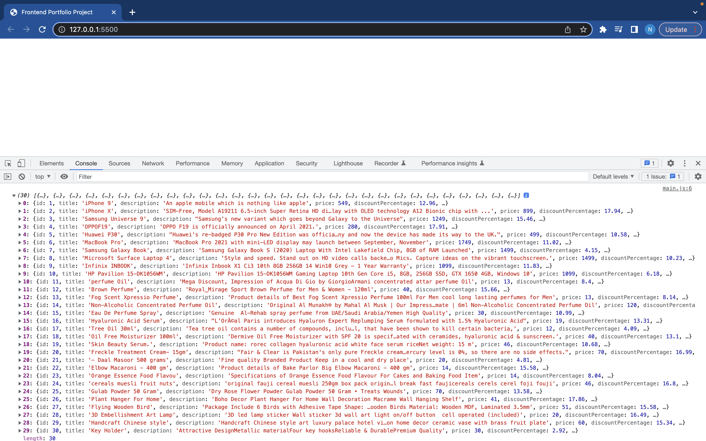

# Front-end-Portfolio-Project

I will create an application using the PURSUIT API for sports facts.

### User Stories

- The user will be able to type a name of the sport that they like to learn facts about in an input box.
- After typing the correct name they will be able to see an image and a link below it which they can click.
- As they click the link below the displayed image related to the sport text they had typed they will be directed to a new web page which will have some facts about the sport

#### Sports info.com Project using PURSUIT API

